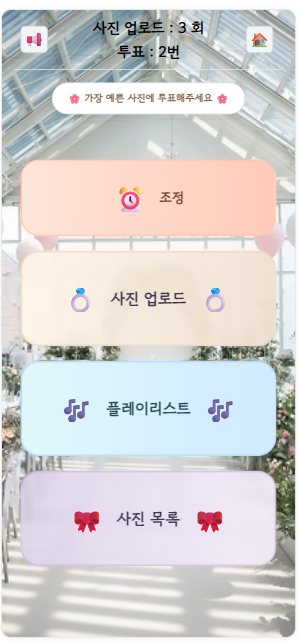

# 💍 Photo Event

하객이 직접 참여하는 **결혼식 사진 이벤트 플랫폼**입니다.  
결혼식장에서 QR코드를 스캔하면, **로그인 없이** 웹 페이지에 접속하여  
직접 사진을 업로드하고, 마음에 드는 사진에 투표할 수 있습니다.  
**Spring Boot + Vue.js** 기반으로 개발되었습니다.

<table>
  <tr>
    <td style="position: relative; text-align:center;">
      
      <div style="position:absolute; top:10px; left:50%; transform:translateX(-50%);
                  background:rgba(0,0,0,0.5); color:white; padding:2px 6px; border-radius:4px;">
        매니저 홈 화면
      </div>
    </td>
    <td style="position: relative; text-align:center;">
      
      <div style="position:absolute; top:10px; left:50%; transform:translateX(-50%);
                  background:rgba(0,0,0,0.5); color:white; padding:2px 6px; border-radius:4px;">
        하객 홈 화면
      </div>
    </td>
  </tr>
</table>

---

## 🔗 QR 생성 사이트

하객 참여용 QR은 다음 사이트에서 쉽게 생성할 수 있습니다:

👉 [https://genqrcode.com/ko/multiple](https://genqrcode.com/ko/multiple)

---

## ✨ 주요 기능

- 📸 **사진 업로드**  
  QR로 접속 후, 본인의 기기로 간단하게 사진을 업로드할 수 있습니다.  
  업로드된 이미지는 **Cloudinary**에 저장되며, 데이터베이스에는 이미지의 URL만 저장됩니다.

- 🎀 **사진 투표**  
  마음에 드는 순간을 투표로 뽑아주세요. 베스트 포토를 함께 만들어갑니다.

- 🔐 **로그인 불필요**  
  별도의 회원가입이나 로그인 없이 바로 참여할 수 있습니다.

- 🎶 **하객 참여형 플레이리스트 (Premium)**   
  버튼을 누르면 미리 설정해 둔 **YouTube 플레이리스트**가 재생되고,  
  하객들은 QR로 접속해 **원하는 곡을 플레이리스트에 추가**할 수 있습니다.

- 💬 **실시간 채팅 (Premium)**  
  하객들은 **닉네임을 1회 설정**한 후 채팅에 참여할 수 있습니다.  
  브라우저를 닫거나 새로고침하면 대화 내용은 삭제되며,  
  관리자는 `!공지` 명령어로 공지를 추가/삭제할 수 있습니다.

  ### 🔧 채팅 관리자 명령어
  
  > 관리자(권한 보유자)만 사용 가능 — 메시지 앞에 `!공지`를 붙여요.
  
  - **공지 추가**
    - 형식: `!공지 <내용>`
    - 예시: `!공지 Quiz : 우리는 어디서 만났을까요~?`
    - 동작: 공지를 **맨 뒤에 추가** (FIFO)
  
  - **공지 1개 제거**
    - 형식: `!공지 지우기` / `!공지 삭제` / `!공지 제거` / `!공지 remove`
    - 예시: `!공지 지우기`
    - 동작: **가장 먼저 등록된 공지(맨 앞)**를 1개 제거
  
  - **공지 전체 제거**
    - 형식(택1):  
      - `!공지 clear`  
      - `!공지 지우기 all` / `!공지 지우기 전부` / `!공지 지우기 모두`  
      - `!공지 삭제 all` / `!공지 제거 모두` … (remove + all/전부/모두 조합)
    - 예시: `!공지 clear`, `!공지 모두 삭제`
    - 동작: **모든 공지 제거**

---

## 💎 요금제별 기능 비교

| **ECO** 🪴                             | **GOLD** 🥇                                                         | **PREMIUM** 👑                                 |
|-----------------------------------------|---------------------------------------------------------------------|------------------------------------------------|
| 📸 사진 업로드: **1회 제한**             | 📸 사진 업로드: **Custom 설정<br>(최대 5회)**                     | 📸 사진 업로드: **Custom 설정<br>(최대 10회)** |
| 🗳️ 투표: **1회 제한**                   | 🗳️ 투표: **Custom 설정<br>(최대 100회)**                           | 🗳️ 투표: **Custom설정<br>(최대 100회)**       |
| ✉️ 상위 사진 이메일 전송: **10장**       | ✉️ 상위 사진 이메일 전송: **30장**                                 | ✉️ 하객 사진 전체 이메일 전송: **ALL**          |
| 💬 문의 이메일 노출: **하단 고정 텍스트** | 💬 문의 이메일 노출: **공지 팝업 하단 표시**<br>📢 공지 이미지 등록 가능 | 💬 문의 이메일 미표기<br>📢 공지 이미지 등록 가능 |
| —  | —  | 🎶 **‘플레이리스트’ 버튼을 통해 <br>YouTube 플레이리스트 재생**<br>🧑‍🤝‍🧑 **하객이 QR로 곡 추가 가능**<br>💬 **실시간 채팅 참여 가능 (닉네임 1회 설정)** |

---

## 📦 외부 서비스 사용 내역

### 버전1 (초기 버전)
- **Render**  
  - **Static Site + Web Services (무료 플랜)** 로 프론트엔드(Vue)와 백엔드(Spring Boot) 배포  
- **Aiven(PostgreSQL)**: PostgreSQL 기반의 클라우드 데이터베이스  
- **Cloudinary**: 이미지 저장 및 URL 제공  

### 🚀 버전2 (현재)
- **Render**  
  - **Static Site** 전용으로 Vue.js 프론트엔드 배포  
- **AWS EC2**  
  - Spring Boot 애플리케이션을 **.jar 형태로 실행**  
- **AWS RDS (db.t4g.micro, PostgreSQL)**  
  - 데이터베이스 전용 인스턴스
- **Cloudinary**: 이미지 저장 및 CDN 제공  

## 🗂️ 아키텍처 요약

- 사용자가 사진을 업로드하면, 이미지 파일은 **Cloudinary**에 저장되고  
- 응답받은 `secure_url`만 **Aiven(PostgreSQL)** (버전1: Aiven[~~NeonDB~~], 버전2: AWS RDS)에 저장됩니다.  
- 이미지 다운로드나 이메일 전송 시에는 해당 URL을 활용하여 Cloudinary에서 직접 불러옵니다.
- **버전1**: Render(Static Site + Web Services) + Aiven(PostgreSQL) + Cloudinary  
- **버전2**: Render(Static Site) + EC2(Spring Boot .jar) + RDS(PostgreSQL) + Cloudinary  

## 💰 리소스 비교

### 버전1 (Render + Aiven + Cloudinary)

| **서비스**     | **리소스 종류**                      | **Free Tier 제공량 (2025 기준)**    | **초과 시 정책 및 제한 사항**  |
|----------------|-------------------------------------|-----------------------------------|-------------------------------|
| **Render**     | Static Site + Web Services (Docker) | - Static Site: 무료<br>- Web Service: RAM 512 MB, 월 750 h 인스턴스, 유휴 시 15분 후 자동 슬립 | - Compute: 월 750 h Limit (초과 시 업그레이드 필요) |
| **Aiven**      | PostgreSQL Database                 | - 단일 전용 VM (공유 아님)<br>- **1 vCPU / 1 GB RAM**<br>- **스토리지 1 GB**<br>- 백업/모니터링 제공, 콘솔/CLI/Terraform 관리<br>- **시간 제한 없음(상시 실행)** | - `max_connections = 20`, 서버측 풀링 없음(PgBouncer 미제공) → 초과 시 에러 및 업그레이드 필요<br>- VPC 피어링/정적 IP/통합/포크/지원/SLA 미제공<br>- 서비스 타입당 1개만 생성 가능<br>- 스토리지 1 GB 초과 시 업그레이드 필요 |
| ~~NeonDB~~     | PostgreSQL Database                 | ~~저장공간: 0.5 GB<br>- **월 191.9 h** 제공(Compute)<br>- 월 5 GB egress<br>- 프로젝트 Max 10개, 브랜치별 Max 500 DB~~ | ~~Compute: 월 191.9 h 제한 (7일 23시간 54분)~~ |
| **Cloudinary** | 이미지 저장 및 CDN                   | - 매월 25 크레딧 제공<br>&nbsp;&nbsp;1) 25 GB 저장 **or**<br>&nbsp;&nbsp;2) 25 GB egress **or**<br>&nbsp;&nbsp;3) 25,000 이미지 변환<br>- 파일 크기: 이미지 10 MB, 비디오 100 MB | - 크레딧 초과 시 업그레이드 권유 (시간 제한 없음, 크레딧 범위 내) |

---

### 🚀 버전2 (AWS EC2 + RDS + Render Static Site + Cloudinary)

| 서비스         | 리소스 종류         | Free Tier 제공량 (신규 계정, 최초 12개월)        | 초과 시 요금 정책                        |
|----------------|-------------------|-------------------------------------------------|----------------------------------------|
| **AWS EC2**    | t3.micro          | 매월 **750시간**(1대 인스턴스 24/7 실행 가능)     | 시간 초과 시 사용 시간 기준 과금 발생     |
| **AWS RDS**    | db.t4g.micro      | 매월 **750시간**의 Single-AZ 인스턴스 사용 + **20 GB SSD 스토리지** + **20 GB 백업 저장소**  | 시간·스토리지 초과 시 과금 발생 |
| **Cloudinary** | 이미지 저장 및 CDN | - 매월 25 크레딧 제공<br>&nbsp;&nbsp;1) 25 GB 저장 **or**<br>&nbsp;&nbsp;2) 25 GB egress **or**<br>&nbsp;&nbsp;3) 25,000 이미지 변환<br>- 파일 크기: 이미지 10 MB, 비디오 100 MB | - 크레딧 초과 시 업그레이드 권유 (시간 제한 없음, 크레딧 범위 내) |
> ※ Free Tier는 **계정 생성일 기준 12개월간** 유효하며, 이후 또는 초과 사용 시 요금이 발생합니다. 

> ✅ 모든 수치는 2025년 기준 **Free Tier** 정보이며, AWS/Render/Cloudinary 정책에 따라 변경될 수 있습니다.  


## 🛠️ 기술 스택

| 구분          | 사용 기술          |
|---------------|-------------------|
| Backend       | Spring Boot       |
| Frontend      | Vue.js            |
| Build Tool    | Gradle            |
| Infra (버전1) | Render, **Aiven(PostgreSQL)** (~~NeonDB~~ 대체), Cloudinary |
| Infra (버전2) | Render(Static Site, Vue.js) + **AWS EC2 (t3.micro, Spring Boot .jar)** + **AWS RDS (db.t4g.micro, PostgreSQL)** + Cloudinary |

---

## ⚙️ 성능 및 안정성 설계

### 🔁 비동기 업로드 처리

- 사진 업로드 요청은 **Spring의 `@Async` 비동기 처리**로 수행되어  
  사용자는 즉시 응답을 받고, 실제 업로드는 **백그라운드**에서 안전하게 진행됩니다.

- Cloudinary 업로드 중 일시적인 네트워크 실패나 API 오류에 대비해  
  **최대 3회 재시도**, **지수 백오프 방식(delay × 2)** 을 적용했습니다.

- 사용자 입장에서는 **업로드가 즉각 반응**하며, 서버에서는 **안정적인 처리**를 보장합니다.

---

### ⚡ 캐시 기반 데이터 조회 최적화

- 성능과 안정성을 위해, DB 직접 조회 대신 **캐시(Cache) 기반 데이터 조회**를 우선적으로 사용합니다.  
- 자주 요청되는 데이터(예: 사용자 조회, 이미지 로드)는 캐시에 저장되어  
  **DB 부하를 줄이고 응답 속도를 향상**시킵니다.  
- 캐시 만료(expiration) 시간이 지나면 자동으로 최신 데이터를 DB에서 다시 가져와  
  **정합성과 최신성**을 보장합니다.

---

### 🧯 동시 업로드 요청 제한

- 동시 API 호출시 무료 티어 환경(Cloudinary)의 자원 초과를 방지하기 위해  
  **세마포어(Semaphore)** 를 활용하여 **동시 업로드 수를 제한**합니다.

- 동시에 처리할 수 있는 업로드 요청 수는 설정값으로 제어되며,  
  초과 시에는 HTTP 429 응답을 반환하여 서버 안정성을 유지합니다.
```java
if (!semaphore.tryAcquire()) {
    return 429; // Too Many Requests
}
...
finally {
    semaphore.release();
}
```
## 🚀 로컬 실행 방법

```bash
# 프론트엔드 실행
cd front
npm install
npm run dev

# 백엔드 실행
cd back
./gradlew bootRun  # Windows는 gradlew.bat 사용
```

---

## ✅ TODO

- [✔] **구독제 기반 기능 개발**
  - ECO 플랜 🌱
    1. [✔] 사진 업로드, 투표 1회 제한
    3. [✔] 상위 사진 10장 이메일 전송
    4. [✔] 문의 이메일 '화면' 하단 고정 노출
  - ECO 플랜 🥇
    1. [✔] 상위 사진 30장 이메일 전송
    2. [✔] 공지 팝업 기능 + 문의 이메일 '팝업' 하단 노출
    3. [✔] 공지 이미지 등록 가능
  - Premium 플랜 👑
    1. [✔] 사진 업로드 최대 10회 제한
    2. [✔] 투표 Custom 횟수 제한
    3. [✔] 문의 이메일 문구 미표기
    4. [✔] 전체 업로드 사진 이메일 전송
    5. [✔] 관리자 투표시간 설정 

- [✔] **병렬 결혼식 이벤트 처리**
  - 1. [✔] 동시에 여러 결혼식 이벤트가 운영될 수 있도록 구조 개선 
  - 2. [✔] 각 결혼식마다 고유 ID를 통해 업로드/투표 데이터 분리 

- [✔] **사진 무단저장 방지**
  - 1. [✔] 마우스 오른쪽클릭, 드래그 방지
  - 2. [✔] Disable Javascript 기능 방지 (img -> canvas)
       
- [✔] **기타사항**
  - 1. [✔] 도메인 관리자 업로드/투표 횟수, 시간설정 가능(Premium Plan)
      - 1-1. [✔] Group별 PLAN 관리
      - 1-2. [✔] 이메일 전송시 Group의 Plan Default반영
  - 2. [✔] 사용자 본인사진 삭제기능
  - 3. [✔] 업로드 사진 1분 Delay적용
  - 4. [✔] 공지사항 팝업창 (이미지)
       
---

## 📌 AI 도구 활용

> 본 프로젝트는 **VibeCoding. AI 생성 기능**을 통해 개발되었습니다.
